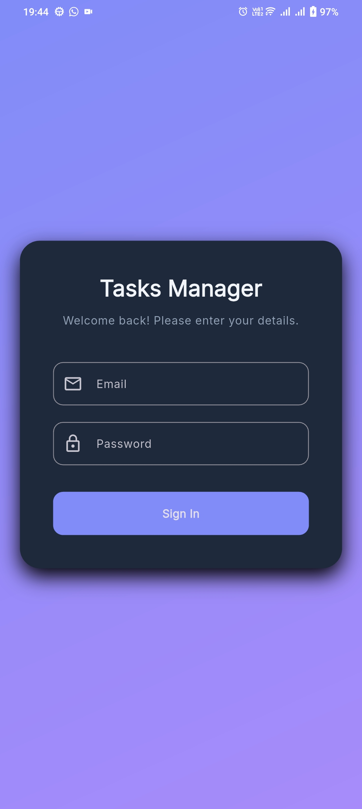
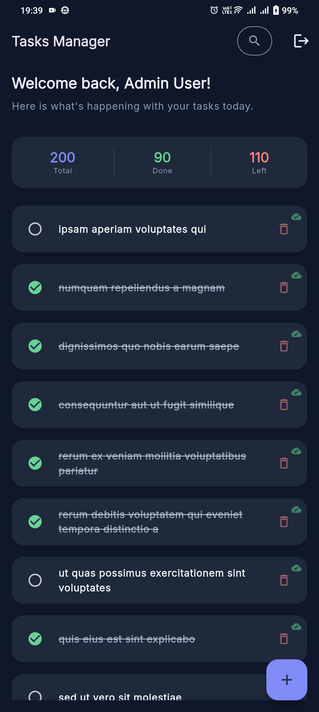
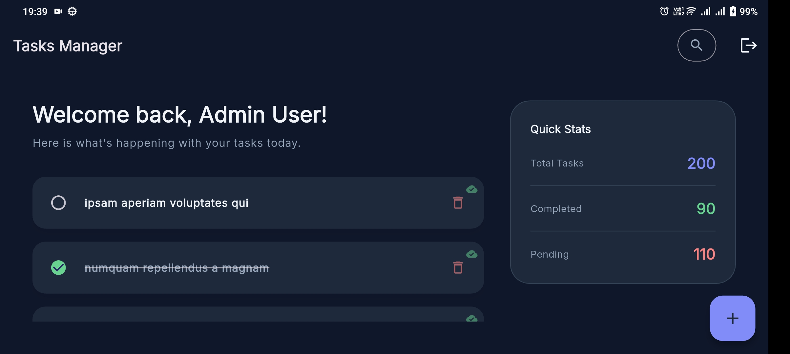
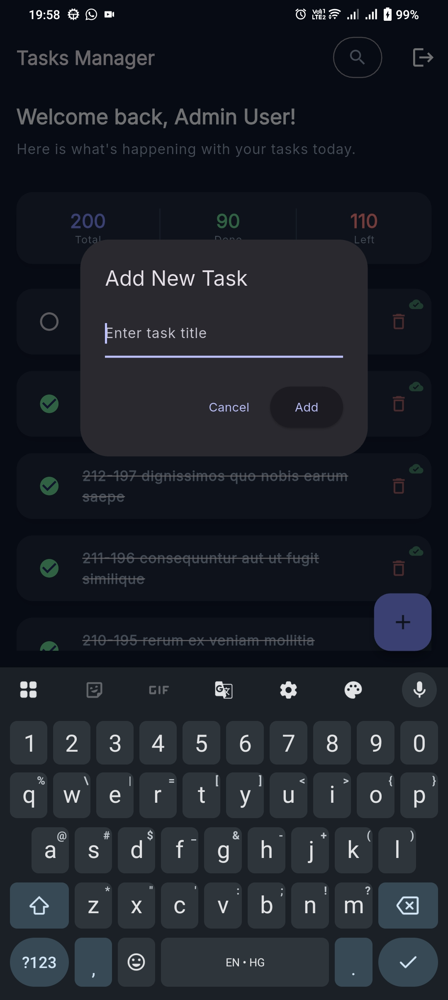

# Flutter Todo App Assignment

A Flutter todo application built with clean architecture, BLoC, `go_router`, `GetIt`, and SQLite-backed offline storage.

## Setup Instructions

1. Install Flutter and verify your environment:
   ```bash
   flutter doctor
   ```
2. Fetch dependencies:
   ```bash
   flutter pub get
   ```
3. Make sure the backend API configured in the network layer is reachable.
4. Run the app:
   ```bash
   flutter run
   ```

## Features Included

- Authentication flow
- `go_router`-based navigation
- `GetIt` service locator for dependency injection
- Clean architecture structure with core, data, domain, and presentation layers
- BLoC state management
- SQLite local storage for todo data
- Dio logging interceptor support for request and response debugging
- SQL query logging with debug prints for database operations
- Add todo
- Edit todo title
- Check and uncheck todo completion state
- Delete todo
- Search todos
- Responsive layout based on screen width
- Light and dark theming with system theme mode support
- Offline-first sync behavior
- Logout functionality
- Todo Upload Status indicator in list view

## Local Data Sync Flow

The app uses SQLite as the local source of truth for todo data. The sync flow works like this:

1. When the app loads, the repository checks network availability through `NetworkInfo`.
2. If the device is online, it first calls `_syncPendingTasks()` to process local task changes that were stored earlier.
3. Local task changes are detected using local flags:
   - `isLocalEdit = 1` means the item was changed locally and still needs syncing.
   - `isDeleted = 1` means the item was deleted locally and still needs syncing.
4. For task deletes:
   - If the task already has a server ID, the repository deletes it on the server first.
   - After success, the local row is removed from SQLite.
5. For task adds:
   - The task is sent to the API.
   - The API responds with `201 Created`, so each successful create is treated as a new todo.
   - The app uses `allowDuplicateServerIds = true` to keep multiple locally created tasks visible even when the backend assigns the same server-side identifier pattern.
   - Because of that flag, `getTaskByServerId` intentionally skips collapsing rows into one record.
   - The created item is inserted locally so the UI can show every newly created task.
6. For task updates:
   - The task is updated on the server.
   - Once successful, the local row is marked as synced.
7. After syncing local changes, the repository fetches the latest tasks from the API.
8. Remote tasks are merged into SQLite using bulk upsert logic.
9. The UI then reads from SQLite so the app continues to work even when offline.

This gives the app an offline-first flow while still keeping local and remote data aligned.

## Assumptions and Design Decisions

- The hardcoded credentials used in the app are acceptable for assignment/demo purposes only, not for production use. Credentials used:
  - userId: `admin`
  - password: `password123`
- The app deliberately allows duplicate server IDs via `allowDuplicateServerIds = true` so repeated create actions remain visible as separate tasks in the UI.
- I assumed the backend returns todos with an integer `id`, a `title`, and a `completed` flag.
- Local records use `localId` as the SQLite primary key, while `id` stores the server ID when available.
- A task can exist locally before it is synced, so new items may temporarily use `id = -1`.
- I kept the repository as the orchestration layer so the UI does not need to know whether data came from the API or SQLite.
- I added `getTaskByServerId` to the database helper so the repository can optionally match server rows when duplicate collapsing is disabled.

## BLoC Pattern

The app uses BLoC to separate UI events from business logic:

- The UI dispatches events such as load, add, update, delete, toggle, or search.
- The BLoC reacts to those events and calls the repository.
- The repository returns domain entities or failures.
- The BLoC emits states that the UI listens to and renders.

This keeps widgets lightweight and makes the data flow predictable and testable.

## Theming

The app supports light and dark themes through Flutter `ThemeData` and `ThemeMode.system`.

- Color palettes are defined in the core theme layer.
- The app uses Google Fonts for typography.
- Theme selection follows the system setting so the UI adapts automatically.

## Responsiveness

The UI adapts to width changes using responsive layout logic:

- Narrow screens use a compact layout.
- Wider screens can show richer side-by-side content.

This keeps the experience usable across mobile, tablet, and desktop window sizes.

## Challenges and How They Were Solved

- Matching server records to local SQLite rows was causing duplicate entries during sync. I solved this by adding `getTaskByServerId` and reusing the existing local row when the server returns an ID that already exists locally.
- Keeping the app usable offline required separating sync state from visible task state. I used explicit local flags so the repository can queue changes and replay them later.
- Preventing the UI from depending on API availability was handled by pushing sync decisions into the repository rather than the presentation layer.
- Supporting navigation and authentication redirects cleanly was handled with `go_router` plus auth state refresh from BLoC.
- Preserving multiple created tasks required making duplicate-server-ID behavior explicit instead of silently merging them in the local database.

## Notes

The database helper currently stores data in `todo_app.db` under the application's documents directory. If you change the schema later, make sure to add migration logic so existing users do not lose data.

For debugging and development visibility, the app logs:

- HTTP requests and responses through a Dio logging interceptor
- SQLite statements through `debugPrint` in the database helper

## Screenshots And Demo

Screenshots:

Authentication screen


Dashboard screen : Portrait Mode


Dashboard screen : Landscape Mode 


Add / Update Todo screen


Demo video:
<video controls src="Screenrecording_20260427_193623.mp4" title="Title"></video>